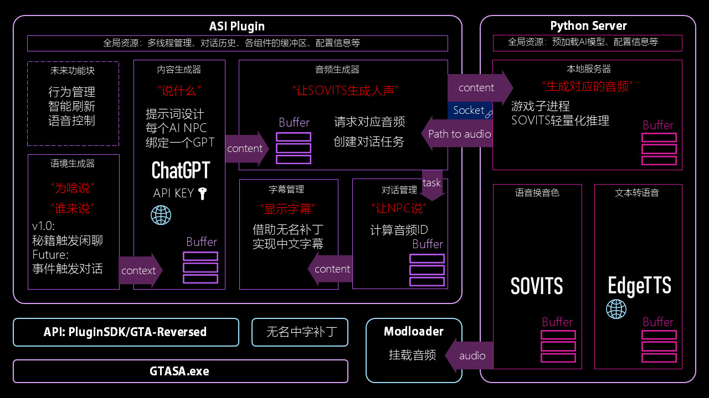

# GTA San Andreas with AI
GTA San Andreas with AI（SAAI），将大语言模型(GPT)、TTS、SOVITS整合进入圣安地列斯，使用真正的AI控制NPC的行为、语音。

## 软件架构

开发环境：Windows11
工具链：Cmake + MSVC

[前端(**Plugin**)](https://github.com/Katock-Cricket/SAAI.Plugin)：[SAAI.Plugin] ASI插件 

[后端(**Server**)](https://github.com/Katock-Cricket/SAAI.Server)：[SAAI.Server] 本地服务器

​    **[[细节实现说明]](./doc/Document.md)** | **[[开发者文档]](./doc/Get Started.md)**

**持续迭代中…**

> v1.1开发计划：（已完成）
>
> - [x] 整理为CMake项目
> - [x] 优化TTS
> - [x] 将TTS单独分离增加一级流水线
> - [x] AI整合进CPed类，取消AIPedPool
> - [x] 修复一些BUG
>

v1.5开发计划：

- [ ] 行为管理模块（控制NPC的更多行为和复杂任务）
- [ ] 语境生成器Plus（生成更加复杂的语境信息）
- [ ] AI行为模型（用操作词的方式约束AI的回答）
- [ ] 智能刷新（与行为管理相似，有复杂逻辑，没想好怎么实现）
- [ ] 语音输入（不知道1.5能不能做这个，可能放到再后面）

联系开发者：[B站_Cyber蝈蝈总](https://space.bilibili.com/37706580)
